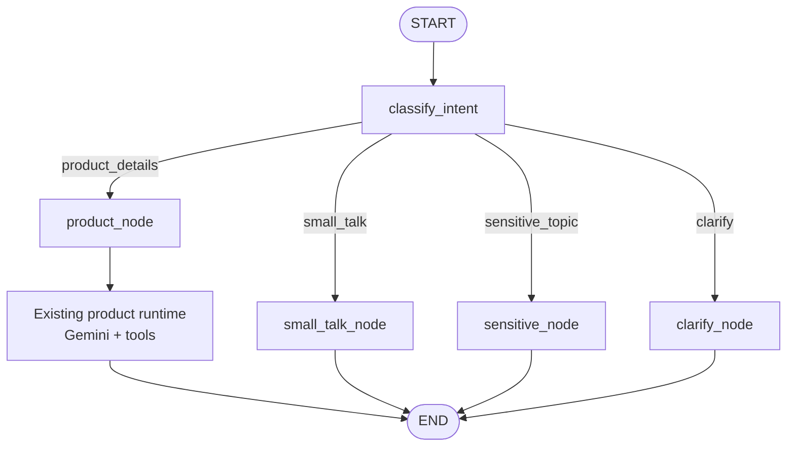
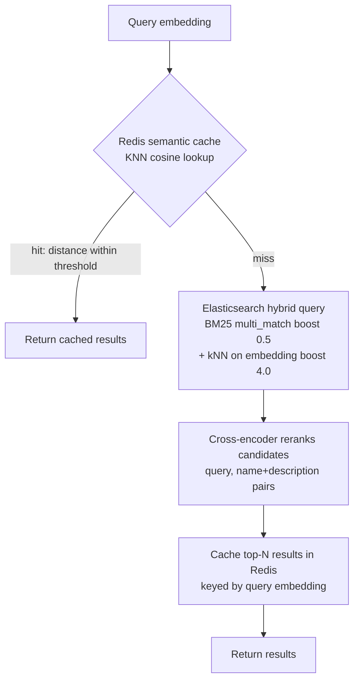
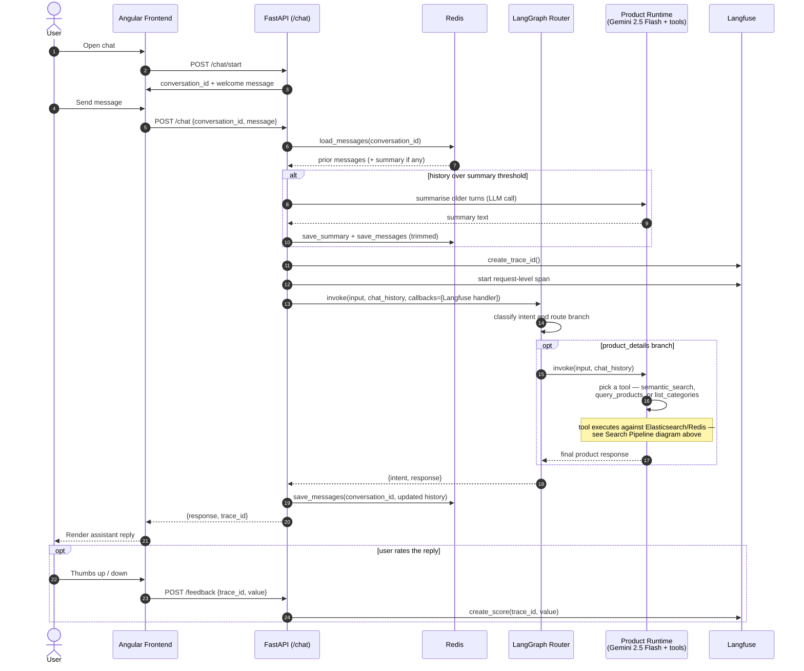

# gdg-mum-langchain-project

A LangGraph-routed ecommerce customer service chatbot: an Angular frontend, a FastAPI backend, Gemini-based product search over Elasticsearch, and a Redis-backed semantic cache and conversation store. Deployed with Docker.

## Overview

The backend now exposes a LangGraph chat workflow that classifies each user turn into one of four intents: `product_details`, `small_talk`, `sensitive_topic`, or `clarify`. Product queries route into the existing Gemini tool-calling product runtime; the other branches return dedicated non-tool responses. Conversation history and summaries live in Redis so the app stays stateful across requests without keeping anything in process memory. Every chat call is traced in Langfuse, and users can leave thumbs up/down feedback tied to that trace.

Product search: Elasticsearch runs a hybrid BM25 + kNN vector query to fetch candidates, a cross-encoder reranks them for relevance, and a Redis vector index caches results by query embedding so near-duplicate questions skip the expensive path.

## Tech Stack

**Backend:**

- FastAPI, Pydantic (`pydantic-settings` for config)
- LangGraph for intent routing and branch orchestration
- LangChain tool-calling runtime with `langchain-google-genai` (Gemini 2.5 Flash)
- Elasticsearch: product catalog, hybrid (BM25 + kNN) search
- `sentence-transformers`: `BAAI/bge-base-en-v1.5` embeddings, `cross-encoder/ms-marco-MiniLM-L-6-v2` reranker
- Redis Stack: conversation history/summaries, rate-limit counters, semantic search cache (vector index)
- Langfuse; tracing and user feedback scoring
- `prometheus-fastapi-instrumentator` + custom counters/histograms — metrics
- `slowapi`: per-IP rate limiting

**Frontend:**

- Angular 19+, TypeScript, RxJS Observables, Angular Material

**Deployment:**

- Docker & Docker Compose
- nginx (serves the Angular build, reverse-proxies `/api/*` to the backend)

## Architecture

1. **Frontend** calls `POST /chat/start` on load; the backend generates a `conversation_id` and returns a welcome message.
2. **Frontend** sends each user message to `POST /chat` (or `/chat/stream`) with that `conversation_id`.
3. **Backend** loads prior messages for that conversation from Redis, summarising older turns once the history passes a configurable threshold (`conversations.py`'s `maybe_summarise`), then invokes `chat_graph` with the user's message and recent history.
4. **LangGraph** classifies the turn into one of four branches:
   - `product_details` — routes into the existing Gemini tool-calling product runtime
   - `small_talk` — handles casual conversation without product tools
   - `sensitive_topic` — handles safety-sensitive prompts without product tools
   - `clarify` — asks the user to clarify unclear intent
5. **The product runtime** (`backend/app/agent.py`) decides whether to call a product tool:
   - `semantic_search` — vague/descriptive queries ("something cozy for winter"), backed by the ES hybrid search + rerank pipeline
   - `query_products` — exact filters (category, price range, rating), backed by a plain ES bool query
   - `list_categories` — so the agent uses exact category names rather than guessing
6. **Backend** saves the updated conversation back to Redis, and returns the response along with a `trace_id` for Langfuse.
7. **Frontend** can submit feedback (thumbs up/down) against that `trace_id` via `POST /feedback`.

### LangGraph architecture (`backend/app/graph.py`)



The current graph is intentionally simple: LangGraph owns intent classification and branching, while the `product_details` branch still delegates to the existing product tool-calling runtime in `backend/app/agent.py`.

### Search pipeline (`backend/search.py`, `backend/cache.py`)



Product embeddings are generated once at index time (`backend/scripts/index_products.py`); query embeddings are generated per-request in `backend/tools.py`. Both use the same BGE model with matching (but asymmetric) instruction prefixes — `"Represent this product for retrieval: ..."` for documents, `"Represent this sentence for searching relevant passages: ..."` for queries — and both normalize embeddings so cosine similarity is meaningful.

See [backend/DATABASE.md](backend/DATABASE.md) for the Elasticsearch index mapping and tool contracts, and [docs/db-models.md](docs/db-models.md) for the full data reference (ES fields + Redis key schemas).

### Conversation Flow



`/chat/stream` follows the same shape, but the current implementation emits a Server-Sent Events envelope consisting of:

- a first event containing `trace_id`
- one text event containing the final graph response
- a terminal `[DONE]` event

It does not currently stream token-by-token model output.

## Features

- LangGraph-based intent routing across product, small-talk, sensitive-topic, and clarify branches
- Tool-calling product runtime over a real product catalog, not just a system-prompted chatbot
- Hybrid lexical + semantic product search with cross-encoder reranking
- Semantic response caching in Redis (near-duplicate queries skip search entirely)
- Server-side conversation history in Redis with automatic summarisation for long conversations
- SSE-compatible chat responses via `/chat/stream` (`trace_id` -> `text` -> `[DONE]`)
- Langfuse tracing on every chat turn, with user feedback (thumbs up/down) tied to a trace
- Prometheus metrics (`/metrics`) — cache hit/miss counters, ES/rerank latency histograms, standard HTTP metrics
- Per-IP rate limiting (20 requests/minute on chat endpoints), backed by Redis so it's consistent across replicas
- `/health` endpoint reporting Elasticsearch and Redis connectivity
- Full Docker Compose deployment (frontend, backend, Redis Stack, Elasticsearch)

## Getting Started

### Prerequisites
- Docker Desktop
- `.env` file in project root with `GOOGLE_API_KEY` set (see [.env.example](.env.example))
- A `backend/.env` for backend-specific overrides — see [backend/.env.example](backend/.env.example) (Redis/ES URLs, cache/conversation TTLs, Langfuse keys)

### Run Locally

```bash
docker compose up --build
```

Then open `http://localhost` in your browser.

### Load sample product data

The Elasticsearch index is created empty on first startup. To populate it with a sample Amazon product catalog (~2k products across 4 categories):

```bash
docker compose exec backend python scripts/index_products.py
```

This generates BGE embeddings for each product and bulk-indexes them — see [backend/DATABASE.md](backend/DATABASE.md) for details.

### Running Tests

Backend unit tests cover the pure logic in `search.py`, `cache.py`, `conversations.py`, and `tools.py` with Elasticsearch/Redis/the embedding model mocked out — no external services required:

```bash
cd backend
pip install -r requirements.txt
pytest
```

LangGraph-specific coverage lives in:

- `tests/test_graph_routing.py` — graph compilation, intent classification, and product-node behavior
- `tests/test_chat_routes.py` — proves `/chat` and `/chat/stream` invoke `chat_graph` and preserve the API contract

These also run automatically in CI (`.github/workflows/backend-tests.yml`) on every push/PR to `main`.

### Setup Guides

- **[DOCKER_SETUP.md](DOCKER_SETUP.md)** — Docker prerequisites, environment setup, troubleshooting
- **[backend/DATABASE.md](backend/DATABASE.md)** — Elasticsearch index, search tools, indexing script
- **[docs/db-models.md](docs/db-models.md)** — full data reference (ES mapping, Redis key schemas)
- **[docs/decisions.md](docs/decisions.md)** — log of major architectural decisions and why they were made

## Key Files

- **backend/app/main.py** — FastAPI app setup: middleware, rate limiter, exception handling, startup (index/cache init)
- **backend/app/graph.py** — LangGraph state, intent classifier, branch routing, and Langfuse graph spans
- **backend/app/agent.py** — product runtime (Gemini tool loop, tool bindings, Langfuse client)
- **backend/app/routes/chat.py** — chat/stream/feedback/conversation endpoints
- **backend/search.py** — Elasticsearch hybrid search, reranking, category listing
- **backend/cache.py** — Redis semantic search cache (vector index)
- **backend/conversations.py** — Redis-backed conversation history + summarisation
- **backend/tools.py** — LangChain tool definitions the agent calls (wraps `search.py`)
- **backend/scripts/index_products.py** — one-time script to load and embed sample product data
- **backend/scripts/run_graph_prompt.py** — simple terminal script for invoking `chat_graph` directly
- **backend/app/config.py** — centralized settings (`pydantic-settings`), single source of truth for all tunables
- **frontend/chatbot-ui/src/app/services/chat.ts** — HTTP/SSE service layer for the chat API
- **frontend/chatbot-ui/src/app/components/chat-panel/chat-panel.ts** — Chat UI with message handling
- **docker-compose.yml** — orchestrates backend, frontend, Redis Stack, and Elasticsearch

## API Endpoints

- `POST /chat/start` — Initialize conversation, returns `conversation_id` and welcome message
- `POST /chat` — Send message, returns AI response + `trace_id`
- `POST /chat/stream` — Same as `/chat`, but returns SSE events in the order `trace_id` -> `text` -> `[DONE]`
- `GET /conversation/{id}` — Retrieve conversation history
- `DELETE /conversation/{id}` — Delete conversation
- `GET /conversations` — List all conversations
- `POST /feedback` — Submit thumbs up/down (+ optional comment) for a given `trace_id`
- `GET /health` — Elasticsearch + Redis connectivity status
- `GET /metrics` — Prometheus metrics

## Development Notes

- Conversations are stored in Redis with a TTL (`conversation_ttl_seconds`, default 24h) — they survive backend restarts but expire eventually, not "forever."
- The product branch is intentionally transitional: LangGraph owns routing, but `product_details` still delegates to the existing tool-calling runtime in `backend/app/agent.py`.
- The system prompt for product requests is hardcoded in `backend/app/agent.py`; it is not currently configurable per-request.
- `small_talk`, `sensitive_topic`, and `clarify` are currently lightweight graph-native branches and should be refined before treating them as production-quality conversational flows.
- Elasticsearch and Redis indices are created automatically on backend startup if they don't already exist (`init_es_index`, `init_cache_index`) — this happens synchronously at import time, so the backend will fail to start if either service is unreachable.
- Langfuse tracing now uses explicit request-level spans in `chat.py`, plus child spans from `graph.py`, so every request produces a visible trace even when no product tools are called.
- See [docs/decisions.md](docs/decisions.md) for why certain architecture choices were made (e.g. ConversationChain to AgentExecutor to LangGraph, LangSmith to Langfuse).
