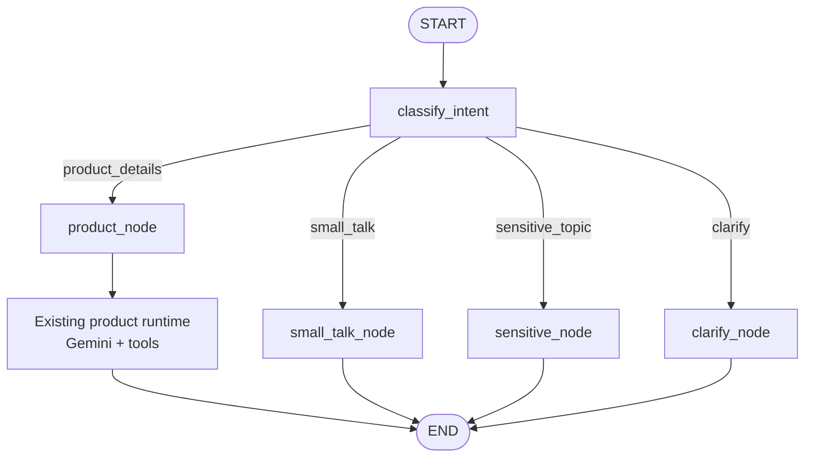
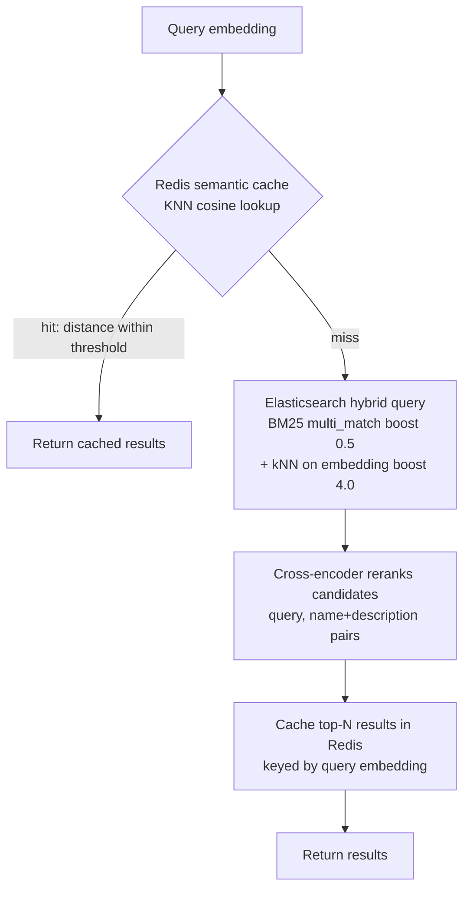
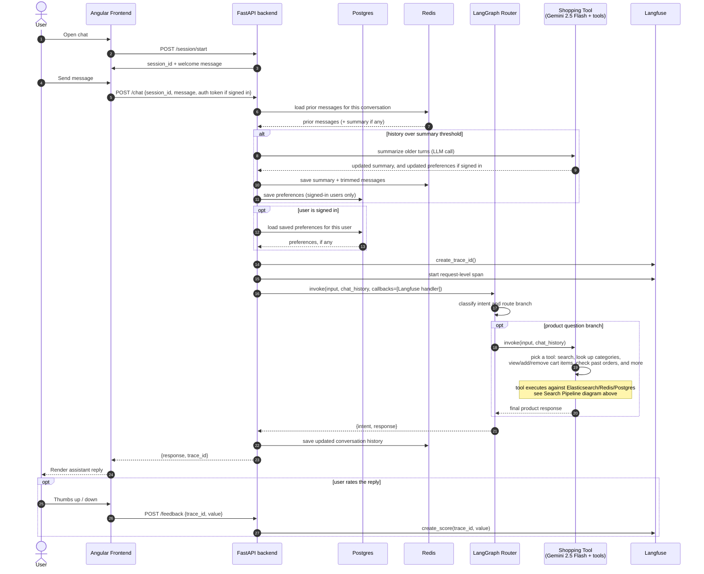

# Shopwise

Shopwise is an ecommerce shopping assistant you chat with. It has an Angular frontend and a FastAPI backend, and it uses Google Gemini to search a product catalog stored in Elasticsearch. People can sign up for a real account or just check out as a guest, they can add items to a cart and place orders, and the assistant remembers their preferences across separate conversations. Everything runs in Docker.

## Overview

Every message you send goes through a LangGraph workflow that first figures out what kind of message it is: a product question, small talk, a sensitive topic, or something unclear. Product questions are handed off to a Gemini-powered tool that searches the catalog and can also add items to your cart or place an order. The other kinds of messages get a simple response with no tools involved.

Conversation history is kept in Redis, so the app can pick up where you left off without holding anything in memory between requests. Once a conversation gets long, older messages are summarized to keep things short.

If you are signed in, Shopwise also remembers things about you between separate conversations, for example that you tend to look for budget laptops or prefer a certain brand. This is stored in the database and is not something guests get, since guests do not have a permanent account.

Every chat message is traced in Langfuse, and you can leave a thumbs up or thumbs down on any reply.

For product search, Elasticsearch runs a search that combines keyword matching and semantic (meaning-based) matching to find candidate products. A second model then reranks those candidates to put the best matches first. Recent search results are also cached in Redis, so asking a very similar question again is fast.

## Tech Stack

**Backend:**

- FastAPI, Pydantic (`pydantic-settings` for config)
- LangGraph for intent routing and branch orchestration
- LangChain tool-calling runtime with `langchain-google-genai` (Gemini 2.5 Flash)
- Elasticsearch: product catalog, hybrid (BM25 + kNN) search
- `sentence-transformers`: `BAAI/bge-base-en-v1.5` embeddings, `cross-encoder/ms-marco-MiniLM-L-6-v2` reranker
- Redis Stack: conversation history/summaries, rate-limit counters, semantic search cache (vector index)
- Langfuse; tracing and user feedback scoring
- `prometheus-fastapi-instrumentator` + custom counters/histograms — metrics
- `slowapi`: per-IP rate limiting

**Frontend:**

- Angular 19+, TypeScript, RxJS Observables, Angular Material

**Deployment:**

- Docker & Docker Compose
- nginx (serves the Angular build, reverse-proxies `/api/*` to the backend)

## Architecture

1. The frontend calls `POST /session/start` when it loads. The backend creates a `session_id` and sends back a welcome message. This works even if you are not signed in, since every visitor gets a session.
2. If you sign up or log in (`POST /auth/signup` or `POST /auth/login`), the backend gives you a token. From then on, the frontend sends that token with every request, and the backend uses it to know who you are.
3. The frontend sends each chat message to `POST /chat` (or `POST /chat/stream` for a streaming reply), along with the session id.
4. The backend loads the earlier messages for that conversation from Redis. If the conversation has gotten long, older messages are summarized first to keep things short. If you are signed in, the backend also loads what it remembers about your preferences and adds that to the context. Then it hands everything to the LangGraph workflow.
5. LangGraph looks at your message and decides what kind of message it is:
   - a product question, which goes to the Gemini-powered shopping tool below
   - small talk, which gets a simple reply with no tools involved
   - a sensitive topic, which gets a safe, non-product reply
   - something unclear, which asks you to clarify
6. For product questions, the shopping tool can call on Gemini to pick from several actions: search the catalog by meaning (for vague requests like "something cozy for winter"), search with exact filters like price or category, list available categories, look up one product, view your cart, add or remove items, change quantities, or look at your past orders. Whether you are signed in or a guest, your cart and orders are tied to your identity so nobody else can see or change them.
7. The backend saves the updated conversation back to Redis and sends back the reply along with a trace id used for tracking in Langfuse.
8. You can leave a thumbs up or thumbs down on any reply by sending that trace id to `POST /feedback`.

### LangGraph architecture (`backend/app/graph.py`)


```mermaid
flowchart TD
    S([START]) --> CI[classify_intent]
    CI -->|product_details| PN[product_node]
    CI -->|small_talk| ST[small_talk_node]
    CI -->|sensitive_topic| SN[sensitive_node]
    CI -->|clarify| CN[clarify_node]

    PN --> PR[Existing product runtime<br/>Gemini + tools]
    PR --> E([END])
    ST --> E
    SN --> E
    CN --> E
```

The current graph is intentionally simple: LangGraph owns intent classification and branching, while the `product_details` branch still delegates to the existing product tool-calling runtime in `backend/app/agent.py`.

### Search pipeline (`backend/search.py`, `backend/cache.py`)


```mermaid
flowchart TD
    Q[Query embedding] --> C{Redis semantic cache<br/>KNN cosine lookup}
    C -->|hit: distance within threshold| R1[Return cached results]
    C -->|miss| ES[Elasticsearch hybrid query<br/>BM25 multi_match boost 0.5<br/>+ kNN on embedding boost 4.0]
    ES --> CE[Cross-encoder reranks candidates<br/>query, name+description pairs]
    CE --> Cache[Cache top-N results in Redis<br/>keyed by query embedding]
    Cache --> R2[Return results]
```

Product and review embeddings are generated once at index time (`backend/scripts/seed_elasticsearch.py`, reading from Postgres); query embeddings are generated per-request in `backend/tools.py`. Both use the same BGE model with matching (but asymmetric) instruction prefixes — `"Represent this product/review for retrieval: ..."` for documents, `"Represent this sentence for searching relevant passages: ..."` for queries — and both normalize embeddings so cosine similarity is meaningful.

See [backend/DATABASE.md](backend/DATABASE.md) for the Elasticsearch index mapping and tool contracts, and [docs/db-models.md](docs/db-models.md) for the full data reference (ES fields + Redis key schemas).

### Conversation Flow


```mermaid
sequenceDiagram
    autonumber
    actor U as User
    participant FE as Angular Frontend
    participant BE as FastAPI backend
    participant PG as Postgres
    participant R as Redis
    participant Graph as LangGraph Router
    participant Product as Shopping Tool<br/>(Gemini 2.5 Flash + tools)
    participant LF as Langfuse

    U->>FE: Open chat
    FE->>BE: POST /session/start
    BE->>FE: session_id + welcome message

    U->>FE: Send message
    FE->>BE: POST /chat {session_id, message, auth token if signed in}
    BE->>R: load prior messages for this conversation
    R-->>BE: prior messages (+ summary if any)
    alt history over summary threshold
        BE->>Product: summarize older turns (LLM call)
        Product-->>BE: updated summary, and updated preferences if signed in
        BE->>R: save summary + trimmed messages
        BE->>PG: save preferences (signed-in users only)
    end
    opt user is signed in
        BE->>PG: load saved preferences for this user
        PG-->>BE: preferences, if any
    end

    BE->>LF: create_trace_id()
    BE->>LF: start request-level span
    BE->>Graph: invoke(input, chat_history, callbacks=[Langfuse handler])
    Graph->>Graph: classify intent and route branch
    opt product question branch
        Graph->>Product: invoke(input, chat_history)
        Product->>Product: pick a tool: search, look up categories,<br/>view/add/remove cart items, check past orders, and more
        Note over Product: tool executes against Elasticsearch/Redis/Postgres<br/>see Search Pipeline diagram above
        Product-->>Graph: final product response
    end
    Graph-->>BE: {intent, response}

    BE->>R: save updated conversation history
    BE-->>FE: {response, trace_id}
    FE-->>U: Render assistant reply

    opt user rates the reply
        U->>FE: Thumbs up / down
        FE->>BE: POST /feedback {trace_id, value}
        BE->>LF: create_score(trace_id, value)
    end
```

`/chat/stream` follows the same shape, but the current implementation emits a Server-Sent Events envelope consisting of:

- a first event containing `trace_id`
- one text event containing the final graph response
- a terminal `[DONE]` event

It does not currently stream token-by-token model output.

## Features

- A chat assistant that understands whether you are asking about a product, making small talk, raising a sensitive topic, or being unclear, and responds appropriately
- Real sign up and login, plus the option to just check out as a guest with no account
- A shopping tool that can search the catalog, add or remove items from your cart, change quantities, check out, and look up your past orders
- Search that combines keyword matching and meaning-based matching, then reranks the results so the best matches come first
- Caching for near-duplicate search questions, so asking something similar again is fast
- Conversation history kept in Redis, with older messages automatically summarized once a conversation gets long
- For signed-in users, the assistant remembers preferences (like preferred brands or budget) across separate conversations, not just within one chat
- Streaming chat replies over `/chat/stream`
- Every chat message is traced in Langfuse, and you can leave a thumbs up or thumbs down on any reply
- Prometheus metrics at `/metrics` for things like cache hits, search latency, and general request stats
- Rate limiting so one visitor cannot send too many chat requests too quickly
- A `/health` endpoint that reports whether Elasticsearch and Redis are reachable
- Everything runs with Docker Compose: frontend, backend, Redis, Elasticsearch, and Postgres

## Getting Started

### Prerequisites

- Docker Desktop
- A `backend/.env` with `GOOGLE_API_KEY` set — see [backend/.env.example](backend/.env.example) for the full list (Redis/ES/DB URLs, Langfuse keys). This is the only `.env` file the app reads (`backend/app/config.py`); `docker compose up` itself doesn't consume it directly (compose passes config via `docker-compose.yml`'s `environment:` blocks), but scripts and any non-Docker local run do.

### Run Locally

```bash
docker compose up --build
```

Then open `http://localhost` in your browser.

### Load sample data

Postgres and Elasticsearch are both created empty on first startup — schema/index creation is automatic, but data seeding is a manual two-step process (Postgres first, since Elasticsearch now reads its seed data from Postgres rather than the raw dataset directly):

```bash
docker compose exec backend python scripts/seed_postgres.py
docker compose exec backend python scripts/seed_elasticsearch.py
```

The first step loads a sample Amazon product/review catalog (~2k products, ~200 reviews across 4 categories) into Postgres. The second reads those rows back out, generates BGE embeddings for each product and review, and bulk-indexes them into Elasticsearch's `products` and `reviews` indices — see [backend/DATABASE.md](backend/DATABASE.md) for details.

### Running Tests

Backend unit tests cover the pure logic in `search.py`, `cache.py`, `conversations.py`, and `tools.py` with Elasticsearch/Redis/the embedding model mocked out — no external services required:

```bash
cd backend
pip install -r requirements.txt
pytest
```

LangGraph-specific coverage lives in:

- `tests/test_graph_routing.py` — graph compilation, intent classification, and product-node behavior
- `tests/test_chat_routes.py` — proves `/chat` and `/chat/stream` invoke `chat_graph` and preserve the API contract

These also run automatically in CI (`.github/workflows/backend-tests.yml`) on every push/PR to `main`.

### Setup Guides

- **[DOCKER_SETUP.md](DOCKER_SETUP.md)** — Docker prerequisites, environment setup, troubleshooting
- **[backend/DATABASE.md](backend/DATABASE.md)** — Elasticsearch index, search tools, indexing script
- **[docs/db-models.md](docs/db-models.md)** — full data reference (ES mapping, Redis key schemas)
- **[docs/decisions.md](docs/decisions.md)** — log of major architectural decisions and why they were made

## Key Files

- **backend/app/main.py** — FastAPI app setup: middleware, rate limiter, exception handling, startup (index/cache init)
- **backend/app/graph.py** — LangGraph state, intent classifier, branch routing, and Langfuse graph spans
- **backend/app/agent.py** — product runtime (Gemini tool loop, tool bindings, Langfuse client)
- **backend/app/routes/chat.py** — chat/stream/feedback/conversation endpoints
- **backend/search.py** — Elasticsearch hybrid search, reranking, category listing
- **backend/cache.py** — Redis semantic search cache (vector index)
- **backend/conversations.py** — Redis-backed conversation history + summarisation
- **backend/tools.py** — LangChain tool definitions the agent calls (wraps `search.py`)
- **backend/scripts/seed_postgres.py** — one-time script to load sample product/review data into Postgres
- **backend/scripts/seed_elasticsearch.py** — one-time script to embed and index Postgres's products/reviews into Elasticsearch
- **backend/scripts/run_graph_prompt.py** — simple terminal script for invoking `chat_graph` directly
- **backend/app/config.py** — centralized settings (`pydantic-settings`), single source of truth for all tunables
- **frontend/chatbot-ui/src/app/services/chat.ts** — HTTP/SSE service layer for the chat API
- **frontend/chatbot-ui/src/app/components/chat-panel/chat-panel.ts** — Chat UI with message handling
- **docker-compose.yml** — orchestrates backend, frontend, Redis Stack, and Elasticsearch

## API Endpoints

### Chat

- `POST /session/start` starts a new session and returns a session id and welcome message
- `POST /chat` sends a message and gets back a reply plus a trace id
- `POST /chat/stream` same as above, but streams the reply back as it is generated
- `GET /conversation/{id}` gets the message history for a conversation
- `DELETE /conversation/{id}` deletes a conversation
- `GET /conversations` lists all conversations
- `POST /feedback` submits a thumbs up or down (with an optional comment) for a given trace id

### Account

- `POST /auth/signup` creates a new account and returns an access token
- `POST /auth/login` logs in with an email and password and returns an access token

### Cart and orders

- `GET /cart/{session_id}` gets the current cart
- `POST /cart/add` adds an item to the cart
- `PATCH /cart/item/{item_id}` changes the quantity of an item in the cart
- `DELETE /cart/item/{item_id}` removes an item from the cart
- `POST /checkout` places an order from the current cart
- `GET /orders/{session_id}` lists past orders

### Products

Used to manage the catalog directly, separate from chat-based search.

- `POST /products` adds a new product
- `PATCH /products/{id}` updates a product
- `DELETE /products/{id}` deletes a product

### Operations

- `GET /health` reports whether Elasticsearch and Redis are reachable
- `GET /metrics` exposes Prometheus metrics

## Development Notes

- Guests and signed-in users are both stored as `User` rows in Postgres. A guest gets a "shadow" user created automatically the first time they act (add to cart, etc). Signing up or logging in just gives a request a JWT token that resolves to a real `User` row instead. See `backend/session_identity.py`'s `resolve_user`.
- Conversations are stored in Redis with a TTL (`conversation_ttl_seconds`, default 24h). They survive backend restarts but expire eventually, not "forever." Long-term preferences for signed-in users are stored separately in Postgres and do not expire.
- The product branch is intentionally transitional: LangGraph owns routing, but `product_details` still delegates to the existing tool-calling runtime in `backend/app/agent.py`.
- The system prompt for product requests is hardcoded in `backend/app/agent.py`; it is not currently configurable per-request.
- `small_talk`, `sensitive_topic`, and `clarify` are currently lightweight graph-native branches and should be refined before treating them as production-quality conversational flows.
- Elasticsearch and Redis indices are created automatically on backend startup if they don't already exist (`init_es_index`, `init_cache_index`), inside an async FastAPI `lifespan` handler. ES/Redis are a _soft_ dependency at boot: if either is unreachable, startup retries a few times, then logs a warning and continues rather than crashing the whole API (#52) — `GET /health` reports the live status either way.
- Langfuse tracing now uses explicit request-level spans in `chat.py`, plus child spans from `graph.py`, so every request produces a visible trace even when no product tools are called.
- See [docs/decisions.md](docs/decisions.md) for why certain architecture choices were made (e.g. ConversationChain to AgentExecutor to LangGraph, LangSmith to Langfuse).

## Evaluation Metrics

1. tone-judge

- What it checks: Whether the assistant's response is polite, professional, and appropriately empathetic, matching the tone expected of a customer service agent, as required by the system prompt.
- Score type: Numeric, 0~1.
  1 : consistently polite, professional, and empathetic.
  0 : unprofessional, cold, dismissive, or otherwise inappropriate for a customer service context.
- Observed behavior:
  A complete, well-formed product answer scored 0.95, with reasoning citing that it was "highly professional and helpful, immediately answering the question and providing relevant product options along with a clear offer for further assistance."
  An empty assistant response (no text returned at all) correctly scored 0, with reasoning noting it was "highly unprofessional, dismissive, and entirely unhelpful in a customer service interaction."

2. no-match-honesty-judge

- What it checks: Specifically whether the assistant is honest when the product search tool returns zero matching products (does it clearly tell the customer nothing was found, rather than inventing or implying a product exists when it doesn't).
- Score type: Boolean.
  true : either (a) the tool returned matching products (check doesn't apply, no violation to flag), or (b) the tool returned zero matches and the response honestly said so.
  false : the tool returned zero matches, but the response fabricated, or implied a product that doesn't exist.
- Observed behavior:
  When the tool returned multiple real matches (a "toy car" query with 4 relevant results, and a "boots" query with 17 relevant results), the judge correctly scored true everytime.

3. groundedness-judge

- What it checks: Whether every specific claim in the assistant's response (product names, prices, ratings) is actually traceable to the real data returned by the product search tool, which the assistant isn't inventing or hallucinating any detail not present in the tool's output.
- Score type: Boolean.
  true : the response is fully grounded, with no fabricated details.
  false : the response includes any information not present in the tool data.
- Observed behavior:
  responses listing real products with matching prices/ratings/review counts (a "toy car" query and a "plushie" query) scored true, with reasoning confirming every detail was "directly traceable to the provided tool data."
  One response for a "toy car with wings instead of wheels" query, where the tool's actual results were all traditional (wingless) toy cars with low similarity scores, correctly scored true on the core claim (the assistant honestly said no exact match was found). However, the assistant also suggested "toy airplanes" or "drones" as alternative categories the customer might want, and the judge scored the overall response false, since those categories never appeared anywhere in the tool's actual data.

4. helpfulness-judge

- What it checks: Whether the assistant's response is genuinely useful to the customer, directly addressing their question, including relevant product details, being honest about no-match situations, and maintaining a professional tone. This is a more holistic, customer-outcome-focused metric than groundedness or tone alone.
- Score type: Numeric, 0~1.
  1 : excellent, fully helpful response.
  0 : not helpful at all.
- Observed behavior:
  Complete response scored 1, directly answering the question with relevant options, prices, and ratings.
  A "toy car with wings" query, where the assistant honestly reported no exact match and suggested alternative categories (toy airplanes, drones), scored 0.9.
  "boots" query returned 17 results, but the specific products shown were mostly boot-related accessories (a boot sleeve, laces, leg gaiters, waders) rather than actual boots, scored 0.45, correctly identifying that "the initial product suggestions are largely accessories or related items rather than the footwear 'boots' the customer likely intended, diminishing its immediate helpfulness." This is a genuine, evaluator-caught retrieval relevance issue in semantic_search.

## Evaluation Results in Summary

1. the agent sometimes returns a completely empty response to a valid product query ("hi, is there toy car?"), rather than any text at all. This was caught by tone-judge scoring it 0, and is a genuine chatbot defect worth root-causing, not a test artifact (Elasticsearch/Redis were confirmed healthy at the time).

2. semantic search relevance issue. A "hi, is there boots" query returned 17 results, but the top items shown were boot accessories (a bottle sleeve, laces, waders) rather than actual boots, scored 0.45, correctly flagged as "largely accessories or related items rather than the footwear 'boots' the customer likely intended." This is a genuine retrieval-quality gap in semantic_search, the tool is returning boot-adjacent products ranked above literal boots.
