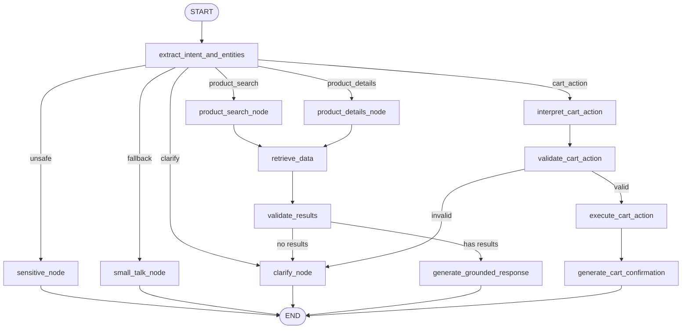
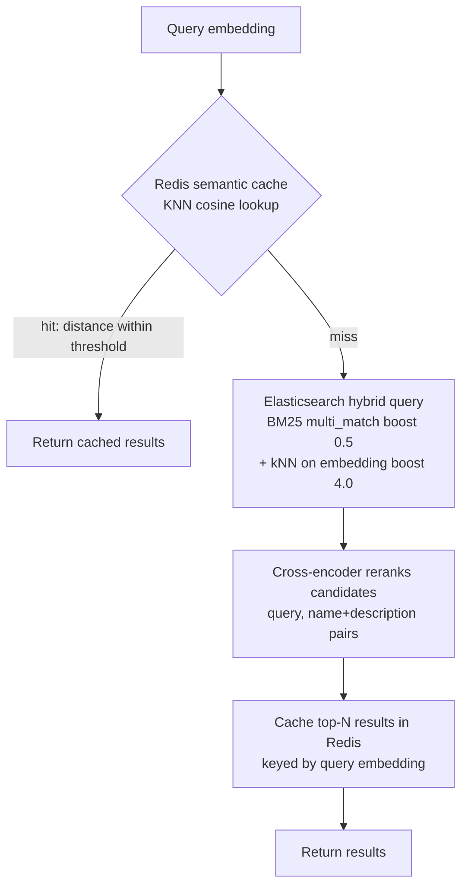
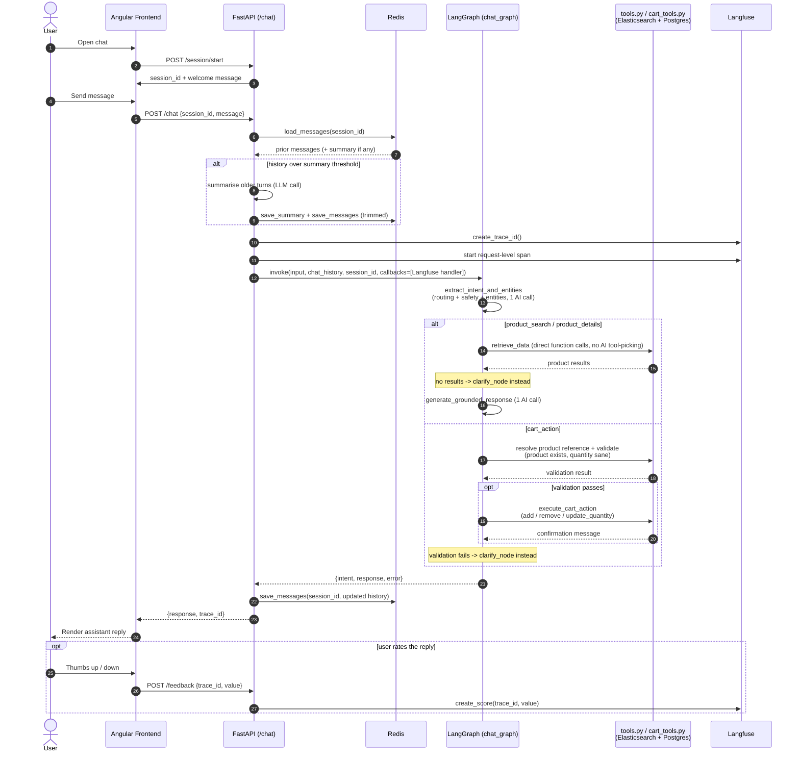

# gdg-mum-langchain-project

A LangGraph-routed ecommerce customer service chatbot: an Angular frontend, a FastAPI backend, Gemini-based product search over Elasticsearch, and a Redis-backed semantic cache and conversation store. Deployed with Docker.

## Overview

The backend exposes a LangGraph chat workflow that classifies each user turn into one of six intents in a single AI call — `product_search`, `product_details`, `cart_action`, `clarify`, `fallback`, or `unsafe` (safety checking is folded into this same routing call, not a separate step) — then routes to a deterministic pipeline for that branch. Product search/details turns retrieve real catalog data before an AI call writes a grounded reply; cart-action turns (add/remove/update quantity) run entirely deterministically after routing, with an explicit validation step guarding against invalid products/quantities before anything mutates the database — see `backend/app/graph.py` and [ARCHITECTURE101.md](ARCHITECTURE101.md) for the full node-by-node breakdown. Conversation history and summaries live in Redis so the app stays stateful across requests without keeping anything in process memory. Every chat call is traced in Langfuse, and users can leave thumbs up/down feedback tied to that trace.

Product search: Elasticsearch runs a hybrid BM25 + kNN vector query to fetch candidates, a cross-encoder reranks them for relevance, and a Redis vector index caches results by query embedding so near-duplicate questions skip the expensive path.

## Tech Stack

**Backend:**

- FastAPI, Pydantic (`pydantic-settings` for config)
- LangGraph for intent routing and branch orchestration
- LangChain tool-calling runtime with `langchain-google-genai` (Gemini 2.5 Flash)
- Elasticsearch: product catalog, hybrid (BM25 + kNN) search
- `sentence-transformers`: `BAAI/bge-base-en-v1.5` embeddings, `cross-encoder/ms-marco-MiniLM-L-6-v2` reranker
- Redis Stack: conversation history/summaries, rate-limit counters, semantic search cache (vector index)
- Langfuse; tracing and user feedback scoring
- `prometheus-fastapi-instrumentator` + custom counters/histograms — metrics
- `slowapi`: per-IP rate limiting

**Frontend:**

- Angular 19+, TypeScript, RxJS Observables, Angular Material

**Deployment:**

- Docker & Docker Compose
- nginx (serves the Angular build, reverse-proxies `/api/*` to the backend)

## Architecture

1. **Frontend** calls `POST /session/start` on load; the backend generates a `session_id` and returns a welcome message.
2. **Frontend** sends each user message to `POST /chat` (or `/chat/stream`) with that `session_id`.
3. **Backend** loads prior messages for that conversation from Redis, summarising older turns once the history passes a configurable threshold (`conversations.py`'s `maybe_summarise`), then invokes `chat_graph` with the user's message and recent history.
4. **LangGraph** (`extract_intent_and_entities`) classifies the turn into one of six branches in a single AI call, extracting minimal entities (product reference, quantity, cart action type) alongside the intent:
   - `product_search` / `product_details` — deterministically retrieve real catalog data (`retrieve_data`), then an AI call writes a reply grounded in that data (`generate_grounded_response`)
   - `cart_action` — deterministically resolves the referenced product and validates it (product exists, quantity sane) *before* mutating the cart; no AI call after routing
   - `unsafe` — safety-sensitive messages, handled without any tool/data access
   - `fallback` — casual conversation / anything else out of scope
   - `clarify` — asks the user to clarify unclear intent (also the fallback destination when a search finds nothing, or a cart action fails validation)
5. **Backend** saves the updated conversation back to Redis, and returns the response along with a `trace_id` for Langfuse.
6. **Frontend** can submit feedback (thumbs up/down) against that `trace_id` via `POST /feedback`.

### LangGraph architecture (`backend/app/graph.py`)


```mermaid
flowchart TB
    START(["START"]) --> IE["extract_intent_and_entities"]
    IE -->|unsafe| SR["sensitive_node"]
    IE -->|fallback| FW["small_talk_node"]
    IE -->|clarify| CL["clarify_node"]
    IE -->|product_search| PS["product_search_node"]
    IE -->|product_details| PD["product_details_node"]
    IE -->|cart_action| CA["interpret_cart_action"]

    PS --> RD["retrieve_data"]
    PD --> RD
    RD --> VR["validate_results"]
    VR -->|has results| GR["generate_grounded_response"]
    VR -->|no results| CL

    CA --> CV["validate_cart_action"]
    CV -->|valid| EC["execute_cart_action"]
    CV -->|invalid| CL
    EC --> CG["generate_cart_confirmation"]

    SR --> END(["END"])
    FW --> END
    CL --> END
    GR --> END
    CG --> END
```

Every intent has a real, purpose-built destination — search/details retrieve real data before an AI call describes it, and cart actions run deterministically (no AI tool-calling loop) with an explicit validation guardrail before any mutation. See [ARCHITECTURE101.md](ARCHITECTURE101.md) for a full walkthrough of each node. (`sensitive_node`/`small_talk_node`/`clarify_node` currently return static placeholder text pending further polish.)

### Search pipeline (`backend/search.py`, `backend/cache.py`)


```mermaid
flowchart TD
    Q[Query embedding] --> C{Redis semantic cache<br/>KNN cosine lookup}
    C -->|hit: distance within threshold| R1[Return cached results]
    C -->|miss| ES[Elasticsearch hybrid query<br/>BM25 multi_match boost 0.5<br/>+ kNN on embedding boost 4.0]
    ES --> CE[Cross-encoder reranks candidates<br/>query, name+description pairs]
    CE --> Cache[Cache top-N results in Redis<br/>keyed by query embedding]
    Cache --> R2[Return results]
```

Product and review embeddings are generated once at index time (`backend/scripts/seed_elasticsearch.py`, reading from Postgres); query embeddings are generated per-request in `backend/tools.py`. Both use the same BGE model with matching (but asymmetric) instruction prefixes — `"Represent this product/review for retrieval: ..."` for documents, `"Represent this sentence for searching relevant passages: ..."` for queries — and both normalize embeddings so cosine similarity is meaningful.

See [backend/DATABASE.md](backend/DATABASE.md) for the Elasticsearch index mapping and tool contracts, and [docs/db-models.md](docs/db-models.md) for the full data reference (ES fields + Redis key schemas).

### Conversation Flow


```mermaid
sequenceDiagram
    autonumber
    actor U as User
    participant FE as Angular Frontend
    participant BE as FastAPI (/chat)
    participant R as Redis
    participant Graph as LangGraph (chat_graph)
    participant Data as tools.py / cart_tools.py<br/>(Elasticsearch + Postgres)
    participant LF as Langfuse

    U->>FE: Open chat
    FE->>BE: POST /session/start
    BE->>FE: session_id + welcome message

    U->>FE: Send message
    FE->>BE: POST /chat {session_id, message}
    BE->>R: load_messages(session_id)
    R-->>BE: prior messages (+ summary if any)
    alt history over summary threshold
        BE->>BE: summarise older turns (LLM call)
        BE->>R: save_summary + save_messages (trimmed)
    end

    BE->>LF: create_trace_id()
    BE->>LF: start request-level span
    BE->>Graph: invoke(input, chat_history, session_id, callbacks=[Langfuse handler])
    Graph->>Graph: extract_intent_and_entities<br/>(routing + safety + entities, 1 AI call)
    alt product_search / product_details
        Graph->>Data: retrieve_data (direct function calls, no AI tool-picking)
        Data-->>Graph: product results
        Note over Graph: no results -> clarify_node instead
        Graph->>Graph: generate_grounded_response (1 AI call)
    else cart_action
        Graph->>Data: resolve product reference + validate<br/>(product exists, quantity sane)
        Data-->>Graph: validation result
        opt validation passes
            Graph->>Data: execute_cart_action<br/>(add / remove / update_quantity)
            Data-->>Graph: confirmation message
        end
        Note over Graph: validation fails -> clarify_node instead
    end
    Graph-->>BE: {intent, response, error}

    BE->>R: save_messages(session_id, updated history)
    BE-->>FE: {response, trace_id}
    FE-->>U: Render assistant reply

    opt user rates the reply
        U->>FE: Thumbs up / down
        FE->>BE: POST /feedback {trace_id, value}
        BE->>LF: create_score(trace_id, value)
    end
```

`/chat/stream` follows the same shape, but the current implementation emits a Server-Sent Events envelope consisting of:

- a first event containing `trace_id`
- one text event containing the final graph response
- a terminal `[DONE]` event

It does not currently stream token-by-token model output.

## Features

- LangGraph-based intent routing across product search/details, cart actions, unsafe, fallback, and clarify branches — safety checking folded into the same routing call, not a separate step
- Deterministic product search/cart-action pipelines over a real product catalog (direct function calls, not an AI tool-calling loop), with an explicit validation guardrail before any cart mutation
- Hybrid lexical + semantic product search with cross-encoder reranking
- Semantic response caching in Redis (near-duplicate queries skip search entirely)
- Server-side conversation history in Redis with automatic summarisation for long conversations
- SSE-compatible chat responses via `/chat/stream` (`trace_id` -> `text` -> `[DONE]`)
- Langfuse tracing on every chat turn, with user feedback (thumbs up/down) tied to a trace
- Prometheus metrics (`/metrics`) — cache hit/miss counters, ES/rerank latency histograms, standard HTTP metrics
- Per-IP rate limiting (20 requests/minute on chat endpoints), backed by Redis so it's consistent across replicas
- `/health` endpoint reporting Elasticsearch and Redis connectivity
- Full Docker Compose deployment (frontend, backend, Redis Stack, Elasticsearch)

## Getting Started

### Prerequisites
- Docker Desktop
- A `backend/.env` with `GOOGLE_API_KEY` set — see [backend/.env.example](backend/.env.example) for the full list (Redis/ES/DB URLs, Langfuse keys). This is the only `.env` file the app reads (`backend/app/config.py`); `docker compose up` itself doesn't consume it directly (compose passes config via `docker-compose.yml`'s `environment:` blocks), but scripts and any non-Docker local run do.

### Run Locally

```bash
docker compose up --build
```

Then open `http://localhost` in your browser.

### Load sample data

Postgres and Elasticsearch are both created empty on first startup — schema/index creation is automatic, but data seeding is a manual two-step process (Postgres first, since Elasticsearch now reads its seed data from Postgres rather than the raw dataset directly):

```bash
docker compose exec backend python scripts/seed_postgres.py
docker compose exec backend python scripts/seed_elasticsearch.py
```

The first step loads a sample Amazon product/review catalog (~2k products, ~200 reviews across 4 categories) into Postgres. The second reads those rows back out, generates BGE embeddings for each product and review, and bulk-indexes them into Elasticsearch's `products` and `reviews` indices — see [backend/DATABASE.md](backend/DATABASE.md) for details.

### Running Tests

Backend unit tests cover the pure logic in `search.py`, `cache.py`, `conversations.py`, and `tools.py` with Elasticsearch/Redis/the embedding model mocked out — no external services required:

```bash
cd backend
pip install -r requirements.txt
pytest
```

LangGraph-specific coverage lives in:

- `tests/test_graph_routing.py` — graph compilation, intent classification, and product-node behavior
- `tests/test_chat_routes.py` — proves `/chat` and `/chat/stream` invoke `chat_graph` and preserve the API contract

These also run automatically in CI (`.github/workflows/backend-tests.yml`) on every push/PR to `main`.

### Setup Guides

- **[DOCKER_SETUP.md](DOCKER_SETUP.md)** — Docker prerequisites, environment setup, troubleshooting
- **[backend/DATABASE.md](backend/DATABASE.md)** — Elasticsearch index, search tools, indexing script
- **[docs/db-models.md](docs/db-models.md)** — full data reference (ES mapping, Redis key schemas)
- **[docs/decisions.md](docs/decisions.md)** — log of major architectural decisions and why they were made

## Key Files

- **backend/app/main.py** — FastAPI app setup: middleware, rate limiter, exception handling, startup (index/cache init)
- **backend/app/graph.py** — LangGraph state, intent classifier, branch routing, and Langfuse graph spans
- **backend/app/agent.py** — product runtime (Gemini tool loop, tool bindings, Langfuse client)
- **backend/app/routes/chat.py** — chat/stream/feedback/conversation endpoints
- **backend/search.py** — Elasticsearch hybrid search, reranking, category listing
- **backend/cache.py** — Redis semantic search cache (vector index)
- **backend/conversations.py** — Redis-backed conversation history + summarisation
- **backend/tools.py** — LangChain tool definitions the agent calls (wraps `search.py`)
- **backend/scripts/seed_postgres.py** — one-time script to load sample product/review data into Postgres
- **backend/scripts/seed_elasticsearch.py** — one-time script to embed and index Postgres's products/reviews into Elasticsearch
- **backend/scripts/run_graph_prompt.py** — simple terminal script for invoking `chat_graph` directly
- **backend/app/config.py** — centralized settings (`pydantic-settings`), single source of truth for all tunables
- **frontend/chatbot-ui/src/app/services/chat.ts** — HTTP/SSE service layer for the chat API
- **frontend/chatbot-ui/src/app/components/chat-panel/chat-panel.ts** — Chat UI with message handling
- **docker-compose.yml** — orchestrates backend, frontend, Redis Stack, and Elasticsearch

## API Endpoints

- `POST /session/start` — Initialize a session, returns `session_id` and welcome message
- `POST /chat` — Send message, returns AI response + `trace_id`
- `POST /chat/stream` — Same as `/chat`, but returns SSE events in the order `trace_id` -> `text` -> `[DONE]`
- `GET /conversation/{id}` — Retrieve conversation history
- `DELETE /conversation/{id}` — Delete conversation
- `GET /conversations` — List all conversations
- `POST /feedback` — Submit thumbs up/down (+ optional comment) for a given `trace_id`
- `GET /health` — Elasticsearch + Redis connectivity status
- `GET /metrics` — Prometheus metrics

## Development Notes

- Conversations are stored in Redis with a TTL (`conversation_ttl_seconds`, default 24h) — they survive backend restarts but expire eventually, not "forever."
- LangGraph now owns the full pipeline for every branch, not just routing — product search/details and cart actions no longer delegate to an AI tool-calling loop; see `backend/app/graph.py` and [ARCHITECTURE101.md](ARCHITECTURE101.md#10-the-ai-pipeline-backendappgraphpy--the-heart-of-the-system). `backend/app/agent.py`'s old tool-calling loop (`AgentExecutorAdapter`) is no longer called by the graph and is pending removal — only `_llm`/`langfuse_client` from that file are still used, by `app/routes/chat.py`.
- Prompts now live in `backend/app/graph.py` (`_INTENT_ENTITY_PROMPT` for routing/entity extraction, `_GROUNDED_RESPONSE_PROMPT` for product replies), not hardcoded per-request.
- `small_talk_node`, `sensitive_node`, and `clarify_node` currently return static placeholder text and should be refined before treating them as production-quality conversational flows.
- Elasticsearch and Redis indices are created automatically on backend startup if they don't already exist (`init_es_index`, `init_cache_index`) — this happens synchronously at import time, so the backend will fail to start if either service is unreachable.
- Langfuse tracing now uses explicit request-level spans in `chat.py`, plus child spans from `graph.py`, so every request produces a visible trace even when no product tools are called.
- See [docs/decisions.md](docs/decisions.md) for why certain architecture choices were made (e.g. ConversationChain to AgentExecutor to LangGraph, LangSmith to Langfuse).
