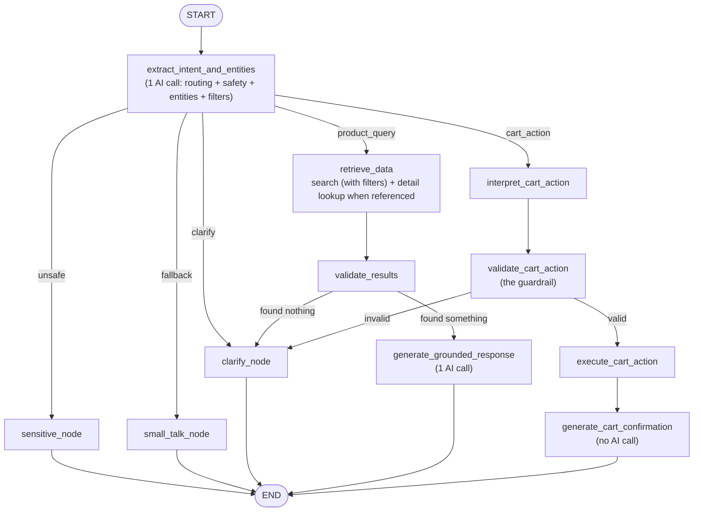

# Issue #57 — Restructuring the LangGraph Chat Flow

Branch: `57-restructure-langgraph-flow`

## Goal

The chatbot's product/cart handling ran through a free-form AI agent loop: one LLM call classified the message, then a second, unconstrained loop let the model freely pick from every available tool, however many times it wanted, to decide what to do. That made behavior hard to predict, hard to test, and expensive (an unbounded number of AI calls per turn). The goal of this restructure was to replace that with a LangGraph pipeline where routing is a single, minimal AI decision and everything downstream — retrieval, cart validation, cart execution — is deterministic, inspectable code. Safety and cost were treated as constraints throughout: no separate AI call should exist unless it's doing something a plain function can't.

## Scoping decisions from the issue

Before implementation, the issue thread settled five points (numbered as in the issue; #5 is a follow-up comment resolving an open question raised alongside #4):

1. **Drop variant validation from CV.** No variant data exists in the seed dataset (already dropped from the schema in #32) — CV validates product + quantity only, not product + variant + quantity.
2. **IE's entity-extraction schema stays minimal: product reference + quantity only.** Category/price/rating filters are *not* pre-extracted by IE — RD hands raw text to the existing `query_products_impl`/`semantic_search_impl`, "which already parse filters/queries themselves."
3. **RD calls `search.py`'s functions directly — no LLM tool-calling loop inside it.** Based on IE's classified intent (product search vs. product details), RD deterministically calls `query_products_impl`/`semantic_search_impl`/`get_product_impl`. Replaces `product_node`'s free-form ReAct loop in `app/agent.py`.
4. **IE is a single LLM call doing both routing and minimal entity extraction** — no second LLM call anywhere in the cart-action path. CA and EC are purely deterministic consumers of IE's output; CV validates IE's extracted product/quantity against the DB.
5. **Safety folded into IE, not a separate node.** IE's intent enum gains a 6th value (`unsafe`) rather than SC existing as its own node — matches how the already-shipped classifier merged safety into routing, and avoids a second AI call on every message to catch a comparatively rare case.

Two of these (#2 and #3) turned out not to hold up once implemented against real behavior — see below.

## What changed

The chat flow now runs through a 5-intent router (`product_query`, `cart_action`, `clarify`, `fallback`, `unsafe`) in a single AI call, followed by a fully deterministic pipeline per branch:

Only 2 AI calls on the happy path for any message — routing, then either a grounded reply or (for cart actions) nothing at all — down from routing plus an unbounded tool-calling loop.

- **`extract_intent_and_entities`** — the only AI call that decides routing. Also extracts, in the same call: a natural-language product reference for follow-ups ("tell me more about that one"), quantity and action type for cart requests, and category/price/rating filters when the message states them exactly. Safety is one of the six possible outcomes (`unsafe`) rather than a separate check, matching how the previous system already handled it.
- **`retrieve_data`** — always runs a search on the message text, and separately fetches a specific product's full details when the extracted reference resolves to a real item. Both a general result list and a specific detail record (when relevant) are handed to the reply-writing step, which decides — from the user's actual phrasing — whether to describe one item in depth or summarize a set of options.
- **`interpret_cart_action` → `validate_cart_action` → `execute_cart_action` → `generate_cart_confirmation`** — resolves the referenced product, then validates it (exists, sane quantity) *before* any database write. No AI reasoning after routing; the confirmation message is the database layer's own human-readable response, reused rather than regenerated.
- The old agent loop (`app/agent.py`'s `AgentExecutorAdapter`, ~140 lines) was removed entirely — nothing calls it anymore.

## Key decisions, and where the original proposal didn't hold up

Decisions #1, #4, and #5 held up exactly as scoped and are unaffected by anything below. #2 and #3 didn't survive contact with implementation:

**Decision #3 proposed classifying "product search" vs. "product details" as two separate intents**, with RD dispatching between them. In practice this forced the routing step to commit, before any data was even looked at, to "the user wants to browse" or "the user wants one specific thing" — with no way to recover if it guessed wrong. That breaks on ordinary follow-ups (a browse turn followed by "tell me more about that one") and on messages that are genuinely both at once. **Resolution:** merged into a single `product_query` intent. `retrieve_data` always searches and separately fetches a detail record when a reference resolves — the distinction between "give me options" and "tell me about this one thing" is now made by the reply-writing step, which has the actual phrasing to work with, rather than being locked in upfront by the router. Decision #3's underlying principle — RD calls `search.py`'s functions directly, no LLM tool-calling loop — is unchanged; only the two-intent dispatch mechanism it specified is gone.

**Decision #2 assumed RD could safely hand raw user text to the existing search functions "since they already parse queries themselves."** True for the semantic search function, false for the exact-filter one (`query_products_impl`), which does no parsing at all — it's a plain function expecting already-separated arguments. Those arguments used to come from the LLM's own tool-call generation in the old agent loop; removing that loop (decision #3, the right call for cost and predictability) removed the thing supplying them, and nothing was designed to replace it. **Resolution:** rather than reconnecting the old exact-filter function, filter support (category/price/rating) was added directly to the semantic search path, so one search call handles both descriptive and exact-constraint queries instead of forking between two. This is a direct revision of decision #2's "filters are not pre-extracted by IE" — they now are, extracted in the same single call as everything else, so decision #4's "one LLM call, no second call" is still honored. This fix was verified, not just implemented — see below.

## Verification

Most of this was validated with unit and end-to-end tests (168 passing across the graph, search, and tool layers). The filter fix specifically was also checked against `golden_dataset.json`, an eval set the team already had in place: before the fix, exact-constraint queries like "electronics under $20" matched **0 of 26** expected products; simply adding a filter only raised that to 6/33, because filtered results were still ranked by relevance to often content-free query text rather than by quality. Sorting filtered results by rating and review count instead — the same convention the old exact-filter tool already used — brought it to **26 of 33 (79%)**, against that tool's own 27/33 (82%) on the same cases.

## Outstanding

- `sensitive_node`, `small_talk_node`, and `clarify_node` still return static placeholder text rather than generated responses. `small_talk_node` also needs renaming to match the current `fallback` intent naming.
